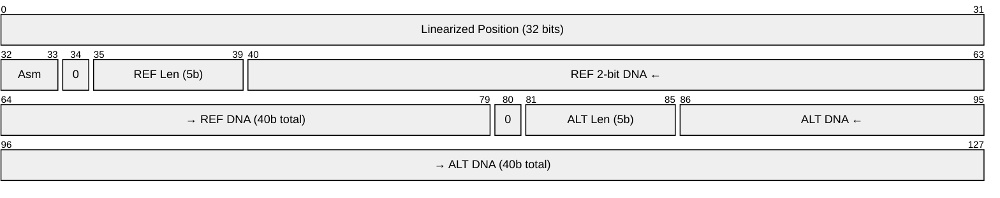
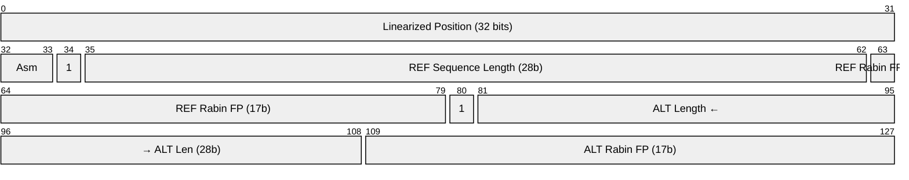
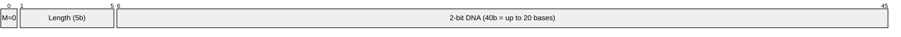
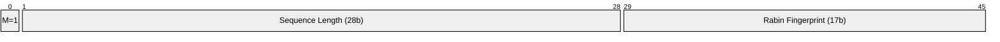

# Bit Layout

Visual diagrams of the 128-bit UVID structure using Mermaid packet diagrams. All bit numbering is MSB-first (bit 0 is the most significant bit in the diagram).

!!! note "Bit numbering convention"
    Mermaid packet diagrams number bits from 0 at the top-left. In these diagrams, bit 0 corresponds to UVID bit 127 (MSB). The mapping is: `diagram_bit = 127 - uvid_bit`.

## Full 128-bit Layouts

### String Mode

Both alleles in string mode (exact 2-bit DNA, up to 20 bases each):

**Row breakdown** (32 bits per row):

| Row | Bits | Content |
|-----|------|---------|
| 1 | 0-31 | Linearized genome position (32 bits) |
| 2 | 32-33 | Assembly (2 bits), then REF: mode=0, length (5b), DNA start (24b) |
| 3 | 64-79 | REF DNA continued (16b), then ALT: mode=0, length (5b), DNA start (10b) |
| 4 | 96-127 | ALT DNA continued (32b) |

### Length Mode

Both alleles in length mode (28-bit length + 17-bit Rabin fingerprint each):

**Row breakdown** (32 bits per row):

| Row | Bits | Content |
|-----|------|---------|
| 1 | 0-31 | Linearized genome position (32 bits) |
| 2 | 32-63 | Assembly (2b), REF: mode=1, length (28b) |
| 3 | 63-95 | REF Rabin fingerprint (17b), ALT: mode=1, length start (15b) |
| 4 | 96-127 | ALT length continued (13b), ALT Rabin fingerprint (17b) |

## Allele Detail

Each allele field is 46 bits. The mode bit determines the interpretation of the remaining 45 bits.

### String Mode Allele (mode = 0)

- **Mode** (1 bit): 0 = string mode
- **Length** (5 bits): number of bases, 1-20
- **DNA** (40 bits): 2-bit encoding per base (A=00, C=01, G=10, T=11), left-aligned

### Length Mode Allele (mode = 1)

- **Mode** (1 bit): 1 = length mode
- **Length** (28 bits): sequence length in bases (max 268,435,455 -- sufficient for chr1 at ~249M bp)
- **Fingerprint** (17 bits): Rabin fingerprint using polynomial x^17 + x^3 + 1

## Design Rationale

### Why 5-bit length (not 6)?

With the mode bit at position 45 and a 6-bit length field, the length would overlap with the first DNA base position. The 5-bit length (max 31, but capped at 20 bases since 40 bits / 2 bits per base = 20) avoids this overlap.

### Why 28-bit length?

The longest human chromosome (chr1) is 248,956,422 bp, which requires 28 bits to represent. The previous design used 45 bits for length (max ~35 trillion), which was unnecessarily large. Capping at 28 bits frees 17 bits for the Rabin fingerprint.

### Why 17-bit Rabin fingerprint?

A 17-bit fingerprint divides collision probability by 131,072 compared to length-only encoding. The polynomial x^17 + x^3 + 1 is irreducible over GF(2), ensuring good distribution. In practice, this eliminated all 113 collisions found in the ClinVar dataset (4.4M records).

### Why symmetric 46/46?

Both REF and ALT alleles get identical 46-bit fields. This simplifies the encoding logic and ensures both alleles benefit from the same exact-storage threshold (20 bases) and fingerprint quality.
