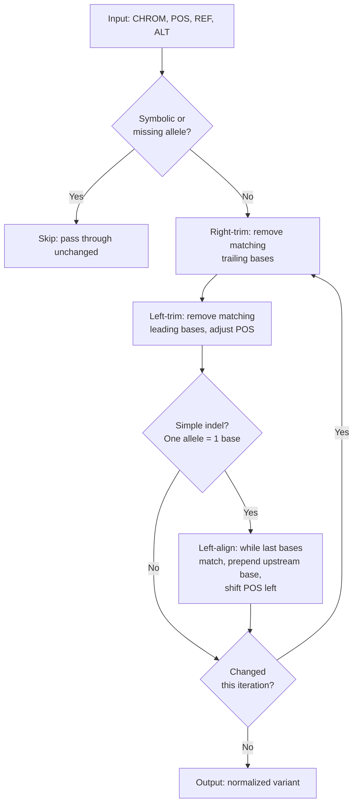

# Variant Normalization

Different VCF representations can describe the same biological variant. For example, the same single-base deletion in a poly-A run can be written at multiple positions depending on the tool that produced the VCF. Without normalization, these representations produce different UVIDs, undermining cross-dataset comparisons.

UVID includes optional variant normalization based on the **Tan et al. 2015** algorithm (left-alignment + parsimonious trimming) to ensure that biologically identical variants always map to the same UVID.

!!! info "Reference"
    Adrian Tan, Gon&ccedil;alo R. Abecasis, Hyun Min Kang. *Unified Representation of Genetic Variants.* Bioinformatics 31(13):2202--2204, 2015. [doi:10.1093/bioinformatics/btv112](https://doi.org/10.1093/bioinformatics/btv112)

## Algorithm

Normalization applies three operations in a loop until convergence:



### What gets normalized

| Variant type | Action |
|---|---|
| SNV (both alleles 1 base) | Pass through |
| Over-specified SNV | Trim shared prefix/suffix |
| Simple indel | Full left-alignment through the reference |
| Complex / MNV (both alleles >1 base after trim) | Trim only, no left-alignment |
| Symbolic allele (`<DEL>`, `<INS>`, `*`) | Skip entirely |
| Missing allele (`.`) | Skip entirely |
| Breakend notation | Skip entirely |

### Per-allele normalization

Multi-allelic records are normalized per-allele (each ALT allele is normalized independently against the reference). This produces the same result as tools that normalize multi-allelic records as a unit in the vast majority of cases; in rare cases where sibling alleles constrain each other, per-allele normalization may left-align further.

## Setup

Normalization requires a reference genome file to fetch upstream bases during left-alignment. UVID auto-discovers reference files from a data directory -- no path parameters need to be passed.

### Reference files

Place one of these files in your UVID data directory:

| File | Size | Description |
|------|------|-------------|
| `GRCh38.2bit` | ~800 MB | GRCh38 in UCSC 2bit format (preferred) |
| `GRCh37.2bit` | ~800 MB | GRCh37 in UCSC 2bit format |
| `GRCh38.fa` + `GRCh38.fa.fai` | ~3 GB | GRCh38 in indexed FASTA format |
| `GRCh37.fa` + `GRCh37.fa.fai` | ~3 GB | GRCh37 in indexed FASTA format |

The `.2bit` format is recommended: it is smaller and faster to load.

!!! tip "Downloading reference genomes"
    ```bash
    # GRCh38 2bit from UCSC
    curl -O https://hgdownload.soe.ucsc.edu/goldenPath/hg38/bigZips/hg38.2bit
    mv hg38.2bit ~/.local/share/uvid/GRCh38.2bit  # Linux
    mv hg38.2bit ~/Library/Application\ Support/uvid/GRCh38.2bit  # macOS

    # GRCh37 2bit from UCSC
    curl -O https://hgdownload.soe.ucsc.edu/goldenPath/hg19/bigZips/hg19.2bit
    mv hg19.2bit ~/.local/share/uvid/GRCh37.2bit  # Linux
    mv hg19.2bit ~/Library/Application\ Support/uvid/GRCh37.2bit  # macOS
    ```

### Data directory

The default data directory is platform-specific:

| Platform | Default path |
|----------|-------------|
| Linux | `~/.local/share/uvid/` |
| macOS | `~/Library/Application Support/uvid/` |
| Windows | `C:\Users\<user>\AppData\Roaming\uvid\` |

Override the default by setting the `UVID_DATA_DIR` environment variable:

```bash
export UVID_DATA_DIR=/path/to/my/references
```

## Usage

### CLI

Add the `--normalize` (or `-n`) flag to the `vcf` command:

```bash
# Normalize and assign UVIDs
uvid vcf input.vcf output.vcf --normalize -a GRCh38

# Normalize with auto-detected assembly
uvid vcf input.vcf output.vcf --normalize

# Combine with other options
uvid vcf input.vcf.gz output.vcf.gz --normalize --uuid

# Short form
uvid vcf input.vcf output.vcf -n -a GRCh38
```

When normalization is active, the output VCF contains the **normalized** POS, REF, and ALT values alongside the UVID. This means the output VCF is a valid normalized VCF, not just an ID-annotated copy.

### Python

```python
from uvid import vcf_passthrough

# With normalization
count = vcf_passthrough("input.vcf", "output.vcf", normalize=True, assembly="GRCh38")

# Auto-detect assembly
count = vcf_passthrough("input.vcf", "output.vcf", normalize=True)
```

### What changes in the output

Without normalization, the passthrough only replaces the ID column. With normalization enabled:

- **ID** column is set to the UVID (computed from normalized coordinates)
- **POS** column is updated to the normalized position
- **REF** column is updated to the normalized reference allele
- **ALT** column is updated to the normalized alternate allele(s)

All other columns (QUAL, FILTER, INFO, FORMAT, samples) are passed through unchanged.

## Examples

### Indel in a homopolymer

A deletion at different positions in a poly-A run normalizes to the same leftmost representation:

```
# Input:   chr1  105  AAAA  A      (deletion at pos 105)
# Input:   chr1  107  AAA   A      (same deletion at pos 107)
# Both normalize to:
#          chr1  101  AAAA  A      (leftmost position)
```

Both produce the same UVID, enabling cross-dataset matching.

### Overspecified SNV

An unnecessarily padded variant is trimmed to its minimal form:

```
# Input:   chr1  100  AGT  ACT
# Normalizes to:
#          chr1  101  G    C       (simple SNV)
```

### Complex variant (no left-alignment)

Complex variants where both alleles are >1 base after trimming are trimmed but not left-aligned:

```
# Input:   chr1  100  CGGA  CA
# Normalizes to:
#          chr1  100  CGG   C      (shared suffix 'A' trimmed)
```

## Cross-validation

The normalization implementation is validated against test suites from three independent tools:

| Source | Cases | Assembly | Description |
|--------|-------|----------|-------------|
| bcftools | 28 | Synthetic | SNVs, indels, complex, symbolic, boundary cases |
| vt | 194 | GRCh37 | Indels on chr20 from Tan et al. original implementation |
| GATK | 19 | GRCh38 | LeftAlignAndTrimVariants: insertions, deletions, repeats |

The bcftools tests run against a small inline reference and are included in every test run. The vt and GATK tests require real reference genome files and are automatically skipped when those files are not available.
